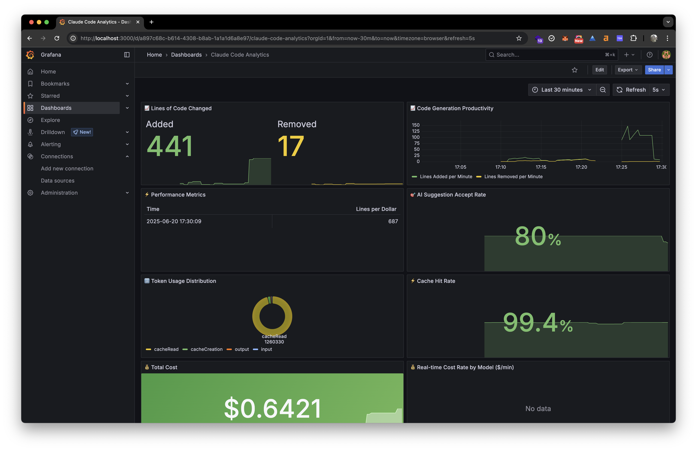

# Claude Code Observability Stack

Complete observability solution for Claude Code using Vector and the Grafana ecosystem. Provides comprehensive telemetry collection, metrics storage, log aggregation, and visualization through OpenTelemetry integration.



## Tech Stack

- **Vector**: High-performance observability data pipeline for OTLP data processing
- **Prometheus**: Time-series metrics database
- **Loki**: Structured log aggregation system  
- **Grafana**: Unified dashboard and visualization platform
- **Docker Compose**: Container orchestration

## Quick Start

### 1. Start the observability stack
```bash
docker-compose up -d
```

### 2. Configure Claude Code telemetry environment
```bash
source claude-code-env.sh
```

### 3. Launch Claude Code
```bash
claude
```

### 4. Access services
- **Grafana Dashboard**: http://localhost:3000 (admin/admin)
- **Prometheus Metrics**: http://localhost:9090
- **Loki Logs**: http://localhost:3100

## Service Endpoints
- **Grafana Dashboard**: http://localhost:3000 (admin/admin)
- **Prometheus Metrics**: http://localhost:9090
- **Loki Logs API**: http://localhost:3100
- **OTLP gRPC Receiver**: http://localhost:4317
- **OTLP HTTP Receiver**: http://localhost:4318
- **Vector API**: http://localhost:8686
- **Vector Metrics**: http://localhost:9091 (Claude Code), http://localhost:9092 (Vector internal)

## Verification
1. Run Claude Code commands
2. Create dashboards in Grafana to view metrics and logs
3. Service appears as `claude-code`

## Key Metrics

This stack captures comprehensive Claude Code telemetry including:

- **Cost Tracking**: `claude_code_cost_usage` - API usage costs by model and user
- **Token Usage**: `claude_code_token_usage` - Input/output/cache token consumption  
- **Code Edits**: `claude_code_code_edit_tool_decision` - User decisions on code suggestions
- **LOC Changes**: `claude_code_lines_of_code_count` - Lines added/removed tracking

See [METRICS.md](METRICS.md) for detailed specifications.

## Troubleshooting
```bash
# Check service logs
docker-compose logs vector
docker-compose logs grafana
docker-compose logs prometheus
docker-compose logs loki

# Restart specific services
docker-compose restart vector
docker-compose restart grafana
```
